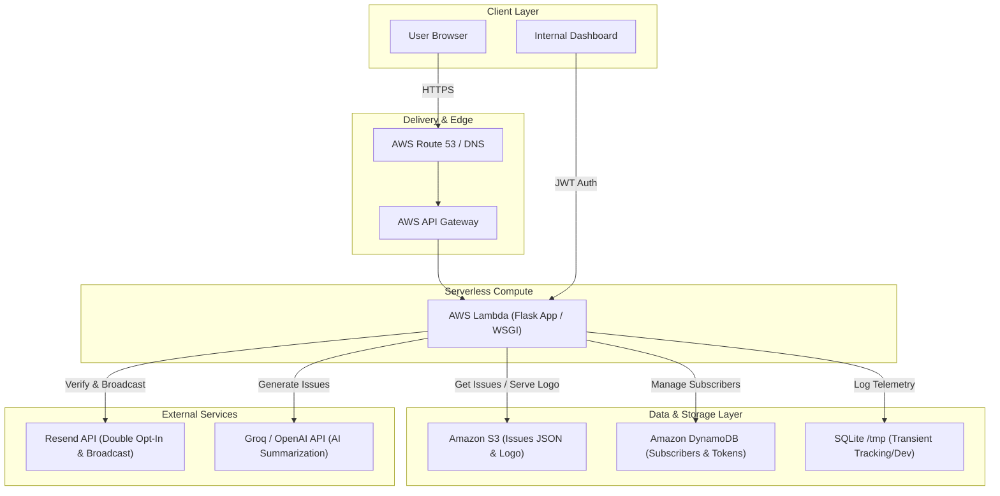

# ZeroDaily - Architectural Overview

ZeroDaily is designed to be highly reliable, cost-efficient, and capable of scaling to zero when idle, while easily absorbing traffic spikes. It features a serverless architecture designed to run seamlessly in **AWS Lambda** combined with **Amazon S3** and **Amazon DynamoDB**, while offering compatibility with containerized Docker environments.

## Architecture Diagram

## Technical Depth & AWS Infrastructure

Deploying a state-of-the-art web application on AWS requires overcoming serverless limitations while optimizing performance and cost. ZeroDaily achieves this through the following core designs:

### 1. AWS Lambda & Serverless Compute
* **ASGI/WSGI Adapter**: The Flask application is mapped to Lambda handler entry points using lightweight adapters (like Zappa or Mangum). Requests from **AWS API Gateway** are converted to standard WSGI environments.
* **Scale-to-Zero Efficiency**: Since newsletters are processed in batch intervals and user reads occur sporadically, hosting the application on Lambda ensures that compute costs are strictly **pay-per-request**, scaling down to $0.00 when there is no traffic.
* **Cold Start Optimization**: The codebase maintains a tiny dependency footprint and uses modular imports so that container initialization times remain under 200ms.

### 2. Static Content Delivery via Amazon S3
* **Decoupled Data Store**: Weekly newsletter issues are generated offline or asynchronously via AI summaries and stored as structured JSON blobs (`issue_YYYY-MM-DD.json`) in an **S3 bucket**.
* **Zero-Database Reads for Content**: When a reader requests a daily issue or visits the archive page, the Lambda function fetches the JSON directly from S3. This reduces read loads and database contention to zero.
* **S3 Logo & Asset Service**: Dynamic brand assets like `logo.png` are served via a dedicated stream handler directly from S3, featuring customized HTTP response headers (`Cache-Control: public, max-age=86400`) to enable browser-side caching.

### 3. Subscriber Persistence with DynamoDB
* **Single-Table Design**: The subscriber registry is stored in a DynamoDB table. Since DynamoDB offers sub-millisecond lookups, subscriber lookup operations during verification and email broadcasting are lightning fast.
* **Secondary Indexes**: Global Secondary Indexes (GSIs) are configured on `verification_token` and `unsubscribe_token` fields, enabling O(1) query performance during authentication and unsubscribe events without performing expensive table scans.
