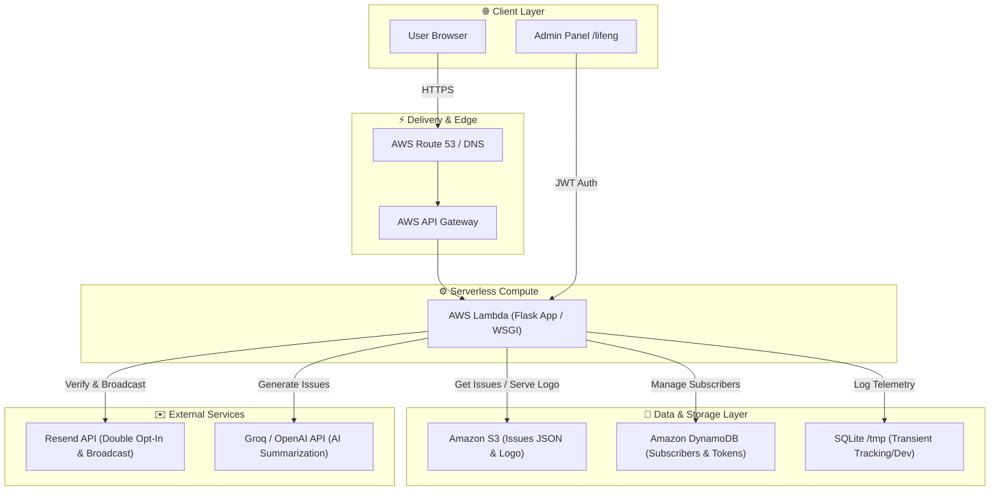

# 🔒 ZeroDaily

[](https://opensource.org/licenses/MIT)
[](https://zerodaily.in)

**ZeroDaily** is a high-performance, serverless, and automated cybersecurity newsletter platform that aggregates, summarizes, and broadcasts threat intelligence, CVEs, and security news. 

The live platform is accessible at: **[zerodaily.in](https://zerodaily.in)**

---

## 🗺️ Architectural Overview

ZeroDaily is designed to be highly reliable, cost-efficient, and capable of scaling to zero when idle, while easily absorbing traffic spikes. It features a hybrid-cloud capable architecture designed to run seamlessly in **AWS Lambda** combined with **Amazon S3** and **Amazon DynamoDB**, while offering compatibility with containerized Docker environments and alternative blob stores (e.g., Azure Blob Storage).



---

## ⚡ Technical Depth & AWS Infrastructure

Deploying a state-of-the-art web application on AWS requires overcoming serverless limitations while optimizing performance and cost. ZeroDaily achieves this through the following core designs:

### 1. AWS Lambda & Serverless Compute
* **ASGI/WSGI Adapter**: The Flask application is mapped to Lambda handler entry points using lightweight adapters (like Zappa or Mangum). Requests from **AWS API Gateway** are converted to standard WSGI environments.
* **Scale-to-Zero Efficiency**: Since newsletters are processed in batch intervals and user reads occur sporadically, hosting the application on Lambda ensures that compute costs are strictly **pay-per-request**, scaling down to $0.00 when there is no traffic.
* **Cold Start Optimization**: The codebase maintains a tiny dependency footprint and uses modular imports so that container initialization times remain under 200ms.

### 2. Static Content Delivery via Amazon S3
* **Decoupled Data Store**: Weekly newsletter issues are generated offline or asynchronously via AI summaries and stored as structured JSON blobs (`issue_YYYY-MM-DD.json`) in an **S3 bucket**.
* **Zero-Database Reads for Content**: When a reader requests a daily issue or visits the archive page, the Lambda function fetches the JSON directly from S3 (or Azure Blob storage). This reduces read loads and database contention to zero.
* **S3 Logo & Asset Service**: Dynamic brand assets like `logo.png` are served via a dedicated stream handler directly from S3, featuring customized HTTP response headers (`Cache-Control: public, max-age=86400`) to enable browser-side caching.

### 3. Subscriber Persistence with DynamoDB
* **Single-Table Design**: The subscriber registry is stored in a DynamoDB table. Since DynamoDB offers sub-millisecond lookups, subscriber lookup operations during verification and email broadcasting are lightning fast.
* **Secondary Indexes**: Global Secondary Indexes (GSIs) are configured on `verification_token` and `unsubscribe_token` fields, enabling O(1) query performance during authentication and unsubscribe events without performing expensive table scans.
* **Fallback Storage Architecture**: For developer environments or multi-cloud flexibility, the application abstracts storage behind [lib/blob_store.py](file:///D:/zeroday/lib/blob_store.py) and [lib/db.py](file:///D:/zeroday/lib/db.py), allowing local SQLite databases to act as transactional trackers, and Azure Containers/local disk storage to serve as fallback stores.

---

## 🚀 Key Features

* **📰 Automated Intelligence Ingestion**: Integrated parser utilities digest security feeds (`feedparser`, `newspaper3k`, `beautifulsoup4`) and employ Groq/OpenAI APIs to summarize dry technical CVEs into readable, engaging security updates.
* **📧 Robust Double Opt-In Flow**: Protects against spam using cryptographic verification tokens. Generates unique `verification_token` and `unsubscribe_token` pairs per subscriber, with email deliverability managed through the **Resend API**.
* **📊 Analytics & Engagement Telemetry**: Custom JavaScript trackers log page-views and active reading session durations. The Flask endpoint logs session lengths back to SQLAlchemy and computes average read times to gauge content interest.
* **🛡️ Security Hardening**:
  * Admin accounts are secured using **bcrypt** hashed credential matches.
  * Successful logins issue short-lived **JWT (JSON Web Tokens)** stored in HTTPOnly, SameSite cookies.
  * Flask-Limiter configures aggressive rate-limiting on sensitive subscription/login routes.
  * Honey-pot fields (`b_url`) intercept automated spam bots.
* **📈 SEO-Engine Ready**: Automatically updates an XML sitemap and a standard RSS feed (`rss.xml`) dynamically as new newsletter issues are published. Includes a `robots.txt` configuration to prevent search engine indexing of sensitive endpoints.
* **🖥️ Telemetry Dashboard (`/lifeng`)**: An interface for admins to monitor total/recent subscribers, database metrics, average reading time, top pages, and system health status.

---

## 📁 Directory Structure

```text
├── D:\zeroday/
│   ├── web/                    # Flask Application & Web Layer
│   │   ├── static/             # Local fallbacks for branding assets
│   │   ├── templates/          # Jinja2 HTML templates (Home, Issue, Dashboard, Auth)
│   │   └── main.py             # App entrypoint, routing, tracking, and Admin endpoints
│   ├── lib/                    # Core Business & Infrastructure Logic
│   │   ├── blob_store.py       # Subscribers storage layer (JSON/Blob abstraction)
│   │   ├── content.py          # Issues content fetching, caching, and text search
│   │   ├── db.py               # SQLAlchemy SQLite engine setup (views, durations)
│   │   ├── health.py           # Multi-point system dependency diagnostic checks
│   │   ├── notifications.py    # Resend email client integration (double opt-in)
│   │   └── validation.py       # Email normalization & parsing safety checks
│   ├── data/                   # Local database storage volume directory
│   ├── start.sh / stop.sh      # Docker Compose initialization shell scripts
│   ├── update.sh / rollback.sh # Zero-downtime deployment pipelines for host servers
│   └── docker-compose.yml      # Orchestration configuration for local development
```

---

## 🛠️ Local Development Setup

To run ZeroDaily locally, follow these steps:

### Prerequisites
* Python 3.10+ or Docker installed.
* Credentials for AWS (or Azure Storage credentials if using the blob fallback).
* A Resend API key for verification email test broadcasts.

### Run with Docker Compose (Recommended)
1. Clone the repository and navigate to the project directory:
   ```bash
   git clone https://github.com/your-repo/zeroday.git
   cd zeroday
   ```
2. Create your `.env` file using the template:
   ```bash
   cp .env.example .env
   ```
   *Edit `.env` and fill in your API keys (e.g., `GROQ_API_KEY`, `RESEND_API_KEY`).*

3. Launch the containerized application:
   ```bash
   ./start.sh
   ```
   *The application will compile and become accessible at `http://localhost:8000`.*

### Run Manually using Python Virtual Environment
1. Initialize the virtual environment:
   ```bash
   python -m venv .venv
   source .venv/bin/activate  # On Windows: .venv\Scripts\activate
   ```
2. Install requirements:
   ```bash
   pip install -r requirements.txt
   ```
3. Run the Flask application:
   ```bash
   python web/main.py
   ```

---

## ⚙️ Environment Variables Config

| Environment Variable | Description |
|---|---|
| `AWS_REGION` | The region where S3 bucket and DynamoDB tables reside (e.g., `us-east-1`). |
| `S3_BUCKET_NAME` | The Amazon S3 bucket name holding asset and issues JSON files. |
| `DYNAMODB_TABLE` | The Amazon DynamoDB table storing subscriber list profiles. |
| `AZURE_STORAGE_CONNECTION_STRING` | Fallback connection string for Azure Blob Storage. |
| `RESEND_API_KEY` | Transactional email client key used for delivering double opt-in mails. |
| `GROQ_API_KEY` / `OPENAI_API_KEY` | API tokens used during daily news ingestion. |
| `ADMIN_USERNAME` | Bcrypt-hashed admin username. |
| `ADMIN_PASSWORD` | Bcrypt-hashed admin password. |
| `JWT_SECRET_KEY` | Symmetric key used to sign Admin Web tokens. |
| `FLASK_SECRET_KEY` | Web application session signing key. |

---

## 📄 License

This project is licensed under the MIT License - see the [LICENSE](file:///D:/zeroday/LICENSE) file for details.
