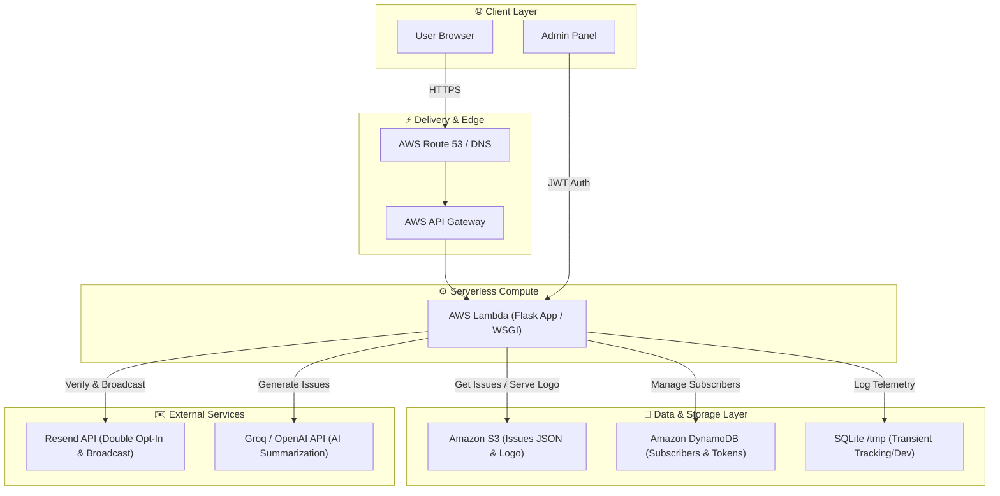

# <svg width="36" height="36" viewBox="0 0 24 24" fill="none" stroke="#3b82f6" stroke-width="2.5" stroke-linecap="round" stroke-linejoin="round" style="vertical-align: middle; margin-right: 8px;"><rect x="3" y="11" width="18" height="11" rx="2" ry="2"></rect><path d="M7 11V7a5 5 0 0 1 10 0v4"></path></svg> ZeroDaily

[](https://opensource.org/licenses/MIT)
[](https://zerodaily.in)

**ZeroDaily** is a high-performance, serverless, and automated cybersecurity newsletter platform that aggregates, summarizes, and broadcasts threat intelligence, CVEs, and security news. 

The live platform is accessible at: **[zerodaily.in](https://zerodaily.in)**

---

## <svg width="26" height="26" viewBox="0 0 24 24" fill="none" stroke="#3b82f6" stroke-width="2" stroke-linecap="round" stroke-linejoin="round" style="vertical-align: middle; margin-right: 8px;"><rect x="3" y="3" width="7" height="9"></rect><rect x="14" y="3" width="7" height="5"></rect><rect x="14" y="12" width="7" height="9"></rect><rect x="3" y="16" width="7" height="5"></rect></svg> Architectural Overview

ZeroDaily is designed to be highly reliable, cost-efficient, and capable of scaling to zero when idle, while easily absorbing traffic spikes. It features a serverless architecture designed to run seamlessly in **AWS Lambda** combined with **Amazon S3** and **Amazon DynamoDB**, while offering compatibility with containerized Docker environments.



---

## <svg width="26" height="26" viewBox="0 0 24 24" fill="none" stroke="#3b82f6" stroke-width="2" stroke-linecap="round" stroke-linejoin="round" style="vertical-align: middle; margin-right: 8px;"><polygon points="13 2 3 14 12 14 11 22 21 10 12 10 13 2"></polygon></svg> Technical Depth & AWS Infrastructure

Deploying a state-of-the-art web application on AWS requires overcoming serverless limitations while optimizing performance and cost. ZeroDaily achieves this through the following core designs:

### 1. AWS Lambda & Serverless Compute
* **ASGI/WSGI Adapter**: The Flask application is mapped to Lambda handler entry points using lightweight adapters (like Zappa or Mangum). Requests from **AWS API Gateway** are converted to standard WSGI environments.
* **Scale-to-Zero Efficiency**: Since newsletters are processed in batch intervals and user reads occur sporadically, hosting the application on Lambda ensures that compute costs are strictly **pay-per-request**, scaling down to $0.00 when there is no traffic.
* **Cold Start Optimization**: The codebase maintains a tiny dependency footprint and uses modular imports so that container initialization times remain under 200ms.

### 2. Static Content Delivery via Amazon S3
* **Decoupled Data Store**: Weekly newsletter issues are generated offline or asynchronously via AI summaries and stored as structured JSON blobs (`issue_YYYY-MM-DD.json`) in an **S3 bucket**.
* **Zero-Database Reads for Content**: When a reader requests a daily issue or visits the archive page, the Lambda function fetches the JSON directly from S3. This reduces read loads and database contention to zero.
* **S3 Logo & Asset Service**: Dynamic brand assets like `logo.png` are served via a dedicated stream handler directly from S3, featuring customized HTTP response headers (`Cache-Control: public, max-age=86400`) to enable browser-side caching.

### 3. Subscriber Persistence with DynamoDB
* **Single-Table Design**: The subscriber registry is stored in a DynamoDB table. Since DynamoDB offers sub-millisecond lookups, subscriber lookup operations during verification and email broadcasting are lightning fast.
* **Secondary Indexes**: Global Secondary Indexes (GSIs) are configured on `verification_token` and `unsubscribe_token` fields, enabling O(1) query performance during authentication and unsubscribe events without performing expensive table scans.

---

## <svg width="26" height="26" viewBox="0 0 24 24" fill="none" stroke="#3b82f6" stroke-width="2" stroke-linecap="round" stroke-linejoin="round" style="vertical-align: middle; margin-right: 8px;"><polyline points="22 12 18 12 15 21 9 3 6 12 2 12"></polyline></svg> Key Features

* <svg width="16" height="16" viewBox="0 0 24 24" fill="none" stroke="#3b82f6" stroke-width="2" stroke-linecap="round" stroke-linejoin="round" style="vertical-align: middle; margin-right: 6px;"><path d="M4 4h16c1.1 0 2 .9 2 2v12c0 1.1-.9 2-2 2H4c-1.1 0-2-.9-2-2V6c0-1.1.9-2 2-2z"></path><path d="M16 8h2"></path><path d="M16 12h2"></path><path d="M16 16h2"></path><path d="M6 8h6v8H6z"></path></svg> **Automated Intelligence Ingestion**: Integrated parser utilities digest security feeds (`feedparser`, `newspaper3k`, `beautifulsoup4`) and employ Groq/OpenAI APIs to summarize dry technical CVEs into readable, engaging security updates.
* <svg width="16" height="16" viewBox="0 0 24 24" fill="none" stroke="#3b82f6" stroke-width="2" stroke-linecap="round" stroke-linejoin="round" style="vertical-align: middle; margin-right: 6px;"><path d="M4 4h16c1.1 0 2 .9 2 2v12c0 1.1-.9 2-2 2H4c-1.1 0-2-.9-2-2V6c0-1.1.9-2 2-2z"></path><polyline points="22,6 12,13 2,6"></polyline></svg> **Robust Double Opt-In Flow**: Protects against spam using cryptographic verification tokens. Generates unique `verification_token` and `unsubscribe_token` pairs per subscriber, with email deliverability managed through the **Resend API**.
* <svg width="16" height="16" viewBox="0 0 24 24" fill="none" stroke="#3b82f6" stroke-width="2" stroke-linecap="round" stroke-linejoin="round" style="vertical-align: middle; margin-right: 6px;"><line x1="18" y1="20" x2="18" y2="10"></line><line x1="12" y1="20" x2="12" y2="4"></line><line x1="6" y1="20" x2="6" y2="14"></line></svg> **Analytics & Engagement Telemetry**: Custom JavaScript trackers log page-views and active reading session durations. The Flask endpoint logs session lengths back to SQLAlchemy and computes average read times to gauge content interest.
* <svg width="16" height="16" viewBox="0 0 24 24" fill="none" stroke="#3b82f6" stroke-width="2" stroke-linecap="round" stroke-linejoin="round" style="vertical-align: middle; margin-right: 6px;"><path d="M12 22s8-4 8-10V5l-8-3-8 3v7c0 6 8 10 8 10z"></path></svg> **Security Hardening**:
  * Admin accounts are secured using **bcrypt** hashed credential matches.
  * Successful logins issue short-lived **JWT (JSON Web Tokens)** stored in HTTPOnly, SameSite cookies.
  * Hardcoded secrets removed. Configurations loaded safely via environment variables.
* <svg width="16" height="16" viewBox="0 0 24 24" fill="none" stroke="#3b82f6" stroke-width="2" stroke-linecap="round" stroke-linejoin="round" style="vertical-align: middle; margin-right: 6px;"><path d="M10 20l4-16m4 4l4 4-4 4M6 16l-4-4 4-4"></path></svg> **Continuous Integration**: Integrated GitHub Actions CI/CD pipeline automates syntax testing and verifies build dependencies on every push.
* <svg width="16" height="16" viewBox="0 0 24 24" fill="none" stroke="#3b82f6" stroke-width="2" stroke-linecap="round" stroke-linejoin="round" style="vertical-align: middle; margin-right: 6px;"><path d="M12 20h9"></path><path d="M16.5 3.5a2.121 2.121 0 013 3L7 19l-4 1 1-4L16.5 3.5z"></path></svg> **Daily Hack Roasts**: Features a witty "Today's Roast" summary of recent hacks. Long security stories are neatly collapsed by default to keep the reading experience focused.
* <svg width="16" height="16" viewBox="0 0 24 24" fill="none" stroke="#3b82f6" stroke-width="2" stroke-linecap="round" stroke-linejoin="round" style="vertical-align: middle; margin-right: 6px;"><polyline points="23 6 13.5 15.5 8.5 10.5 1 18"></polyline><polyline points="17 6 23 6 23 12"></polyline></svg> **SEO-Engine Ready**: Automatically updates an XML sitemap and a standard RSS feed (`rss.xml`) dynamically. Includes a `robots.txt` configuration.
* <svg width="16" height="16" viewBox="0 0 24 24" fill="none" stroke="#3b82f6" stroke-width="2" stroke-linecap="round" stroke-linejoin="round" style="vertical-align: middle; margin-right: 6px;"><rect x="2" y="3" width="20" height="14" rx="2" ry="2"></rect><line x1="8" y1="21" x2="16" y2="21"></line><line x1="12" y1="17" x2="12" y2="21"></line></svg> **Telemetry Dashboard**: An interface for admins to monitor total/recent subscribers, database metrics, and system health status.

---

## <svg width="26" height="26" viewBox="0 0 24 24" fill="none" stroke="#3b82f6" stroke-width="2" stroke-linecap="round" stroke-linejoin="round" style="vertical-align: middle; margin-right: 8px;"><path d="M22 19a2 2 0 0 1-2 2H4a2 2 0 0 1-2-2V5a2 2 0 0 1 2-2h5l2 3h9a2 2 0 0 1 2 2z"></path></svg> Directory Structure

```text
├── D:\zeroday/
│   ├── .github/                # GitHub Actions CI/CD workflows
│   ├── web/                    # Flask Application & Web Layer
│   │   ├── static/             # Local fallbacks for branding assets
│   │   ├── templates/          # Jinja2 HTML templates (Home, Issue, Dashboard, Auth)
│   │   └── main.py             # App entrypoint, routing, tracking, and Admin endpoints
│   ├── lib/                    # Core Business & Infrastructure Logic
│   │   ├── blob_store.py       # Subscribers storage layer (JSON/Blob abstraction)
│   │   ├── content.py          # Issues content fetching, caching, and text search
│   │   ├── db.py               # SQLAlchemy SQLite engine setup (views, durations)
│   │   ├── health.py           # Multi-point system dependency diagnostic checks
│   │   ├── notifications.py    # Resend email client integration (double opt-in)
│   │   └── validation.py       # Email normalization & parsing safety checks
│   ├── data/                   # Local database storage volume directory
│   ├── start.sh / stop.sh      # Docker Compose initialization shell scripts
│   ├── update.sh / rollback.sh # Zero-downtime deployment pipelines for host servers
│   └── docker-compose.yml      # Orchestration configuration for local development
```

---

## <svg width="26" height="26" viewBox="0 0 24 24" fill="none" stroke="#3b82f6" stroke-width="2" stroke-linecap="round" stroke-linejoin="round" style="vertical-align: middle; margin-right: 8px;"><circle cx="12" cy="12" r="3"></circle><path d="M19.4 15a1.65 1.65 0 0 0 .33 1.82l.06.06a2 2 0 1 1-2.83 2.83l-.06-.06a1.65 1.65 0 0 0-1.82-.33 1.65 1.65 0 0 0-1 1.51V21a2 2 0 0 1-4 0v-.09A1.65 1.65 0 0 0 9 19.4a1.65 1.65 0 0 0-1.82.33l-.06.06a2 2 0 1 1-2.83-2.83l.06-.06a1.65 1.65 0 0 0 .33-1.82 1.65 1.65 0 0 0-1.51-1H3a2 2 0 0 1 0-4h.09A1.65 1.65 0 0 0 4.6 9a1.65 1.65 0 0 0-.33-1.82l-.06-.06a2 2 0 1 1 2.83-2.83l.06.06a1.65 1.65 0 0 0 1.82.33H9a1.65 1.65 0 0 0 1-1.51V3a2 2 0 0 1 4 0v.09a1.65 1.65 0 0 0 1 1.51 1.65 1.65 0 0 0 1.82-.33l.06-.06a2 2 0 1 1 2.83 2.83l-.06.06a1.65 1.65 0 0 0-.33 1.82V9a1.65 1.65 0 0 0 1.51 1H21a2 2 0 0 1 0 4h-.09a1.65 1.65 0 0 0-1.51 1z"></path></svg> Environment Variables Config

| Environment Variable | Description |
|---|---|
| `AWS_REGION` | The region where S3 bucket and DynamoDB tables reside (e.g., `us-east-1`). |
| `S3_BUCKET_NAME` | The Amazon S3 bucket name holding asset and issues JSON files. |
| `DYNAMODB_TABLE` | The Amazon DynamoDB table storing subscriber list profiles. |
| `RESEND_API_KEY` | Transactional email client key used for delivering double opt-in mails. |
| `GROQ_API_KEY` / `OPENAI_API_KEY` | API tokens used during daily news ingestion. |
| `ADMIN_USERNAME` | Bcrypt-hashed admin username. |
| `ADMIN_PASSWORD` | Bcrypt-hashed admin password. |
| `JWT_SECRET_KEY` | Symmetric key used to sign Admin Web tokens. |
| `FLASK_SECRET_KEY` | Web application session signing key. |

---

## <svg width="26" height="26" viewBox="0 0 24 24" fill="none" stroke="#3b82f6" stroke-width="2" stroke-linecap="round" stroke-linejoin="round" style="vertical-align: middle; margin-right: 8px;"><path d="M14 2H6a2 2 0 0 0-2 2v16a2 2 0 0 0 2 2h12a2 2 0 0 0 2-2V8z"></path><polyline points="14 2 14 8 20 8"></polyline><line x1="16" y1="13" x2="8" y2="13"></line><line x1="16" y1="17" x2="8" y2="17"></line><polyline points="10 9 9 9 8 9"></polyline></svg> License

This project is licensed under the MIT License - see the [LICENSE](file:///D:/zeroday/LICENSE) file for details.
